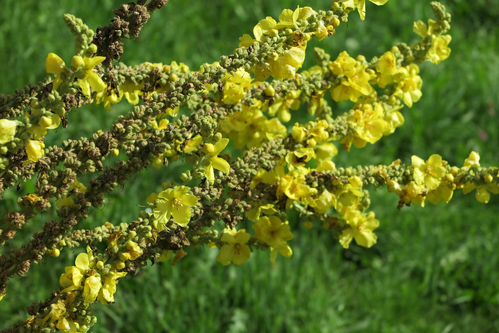
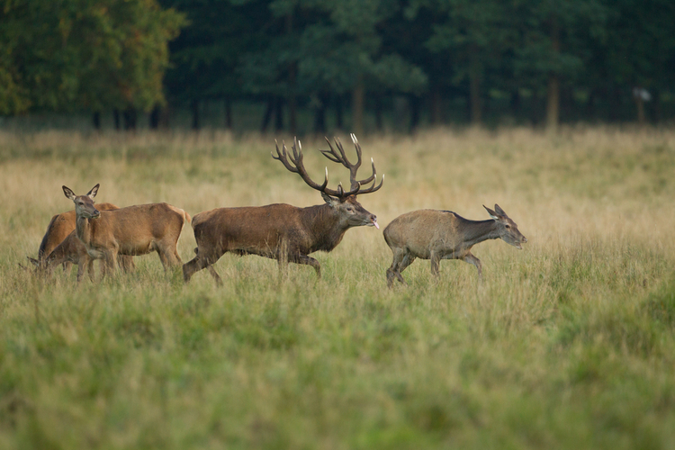

+++
title = "Flora und Fauna "
date = "2023-09-18"
draft = false
pinned = false
tags = ["Natur", "Tier", "Pflanzen"]
image = "flopra-faune-habkern.jpeg"
description = "über die vielfältige Pflanzen- und Tierwelt von Habkern"
+++
In Habkern ist die Tier- und Pflanzenwelt sehr ausgeprägt und vielfältig. Tagsüber kommt es oft vor, dass man dem ein oder anderen Steinbock begegnet. Abends kann man dann die Rothirsche beobachten. 

Zu der Vegetation von Habkern gehören Blumen, Bäume, Sträucher und vieles mehr. Diese Vielfalt an Pflanzenarten ist sehr beeindruckend und lässt den Ein oder Anderen oftmals staunen. 

Die Flora und somit auch die Vegetation in Habkern wird hauptsächlich durch die Höhenlage, den geologischen Untergrund, die Topografie, die klimatischen Bedingungen und die menschliche Nutzung geprägt. Ein Grossteil des Gebietes liegt in der Nadelwaldstufe mit kühl-feuchten Bedingungen und wasserstauenden Böden aus Flysch (ein Gestein welches oft zu Hangrutschen neigt). Über der Waldgrenze wachsen vor allem alpine Rasen. Den Schatz der Lombachalp bilden die Hochmoore. Sie sind hier in einer Qualität vorhanden, die schweizweit selten ist. Hier wachsen Pflanzen wie der Sonnentau, die im Konkurrenzkampf mit anderen Pflanzen an anderen Standorten keine Chance haben.

Wir als Klasse waren kurz vor dem Winter in Habkern und haben dort dementsprechend nicht so viele Blumen und Tiere gesehen. Im Sommer sind die Wiesen gefüllt on Blüten und Tierchen die sobald es kälter wird nicht mehr so präsent sind. Doch das was wir gesehen haben war toll. Wenn wir von unserem Titel ausgehen wollen beginnen wir bei den ganzen Blumen, Moosen und Bäumen. 

**Die Königskerze**

Sie wächst an den sonnigen Hängen bis zu 150cm hoch und sieht mit ihren strahlend gelben Blüten königlich aus. Die Königskerze (Verbascum) gehört zu der Familie der Braunwurzgewächse. Diese Gattung umfasst etwa 300 Arten und ist in Eurasien weit verbreitet. Sie ist sehr robust und überhaupt nicht anspruchsvoll wenn es um die Bodenbeschaffenheit geht. Deshalb wächst die auch so gut an den teils trockenen Hängen. Solange sie nicht im Schatten steht, und sei es nur ein leichter Halbschatten, wächst die Königskerze stabil und hoch. 

*Wofür ist diese Blume gut?* Die völlig ungiftigen Blüten werden oft als Tee aufgekocht und sollen Beschwerden wie Erkältungen, Halsschmerzen, und vieles mehr lindern. Dazu kommt noch, dass die Königskerze entzündungshemmend ist

**Die Rothirsche**

Im September und Oktober ist die Chance, dass man diese prachtvollen Tiere sieht, sehr hoch, da dann ihre Brunftzeit ist. Das ist die Zeit im Jahr, in der sich die Hirsch-Stiere um die Hirsch-Kühe rangen. Dann kann man sie manchmal röhren hören. Im Frühling kommen dann die Hirsch-Kälber auf die Welt. 

Durchschnittlich werden die Rothirsche um die 14 Jahre alt. Die Kühe können sogar bis zu 17 Jahre lang leben. Sie sind Pflanzenfresser und haben wenig bis gar keine natürlichen Feinde im Wald.

Als wir die Rothirsche beobachtet haben waren wir in einer Jägerhütte gegenüber des Berghangs mit den Tieren und haben sie durch Ferngläser und -rohre gesehen. Manchmal haben wir sogar ein paar 'Gemschi' entdeckt. 

