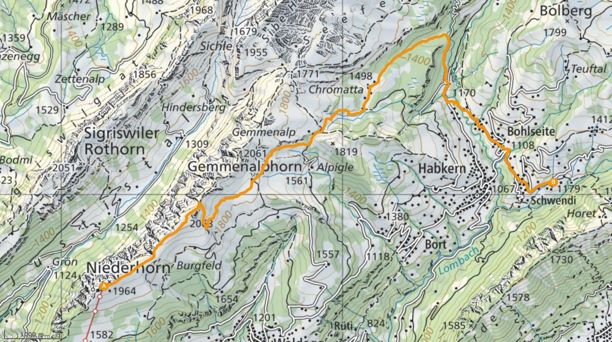

+++
title = "Hochmoorlandschaft in Habkern"
date = "2023-09-18"
draft = false
pinned = false
tags = ["G27f", "Natur", "Wandern", "Habkern"]
image = "oip.jpg"
description = "Da Wunderschöne u einzigartige hochmoor vo habkere"
+++
**Die Hochmoore in Habkern** 

Jahrtausendalte, unberührte Natur. Und doch wichtig für unser Ökosystem. Das sind die Schweizer Hochmoore. Die zweitgrösste Moorlandschaft der Schweiz ist das Habkern-Sörenberg Hochmoor. Da wir unsere Unterkunft in der Nähe haben, bietet es sich an, um einmal einen Blick auf  eine solche Moorlandschaft zu werfen.

Während wir unsere 5 Stunden Wanderung vom Niederhorn nach Habkern gemeistert haben, sahen wir tatsächlich einige Moorlandschaften. Wir müssen zugeben das es uns manchmal schwergefallen ist eine zu erkennen. Dennoch war die Vegetation dieser Moore eindrücklich zu sehen. Mann hat erkannt das diese Umgebung sehr feucht und Wasserhaltig ist. Vor allem im Wald der etwa auf 1400m.ü.m. liegt gab es auch viele verschiedene Variationen von Sumpf artigen Mooren. Die man ohne dreckige Schuhe zu bekommen nur schwer durchqueren konnte. Da der Boden sehr Matschig war. Es ist deswegen so matschig weil Hochmoore wegen hohen und gleichmässigen Niederschlagsmengen sehr feucht sind. Ebenfalls ist es dort so feucht weil der Niederschlag höher ist als der Abfluss und die Verdunstung ist. Dies ist auch der Gründe dafür das Hochmoore entstanden sind. Nur wenige Pflanzen können in solchem Klima gut Überleben, deshalb gibt es sogenannte Hochmoorspezialisten. Dazu gehören Torfmoos. Heidekraut oder auch das Wollgras. Wenn eine solche Pflanze abstirbt zersetzt sich diese nur sehr Langsam, da das Wasser sauer ist. Also sammeln sich die toten Pflanzen an und bilden Torf. Nun gut, aber warum sind Hochmoore gut für unser Ökosystem? Das liegt daran weil in Hochmooren grosse mengen Kohlenstoff gespeichert sind. Jedoch sind solche Hochmoore gefährdet weil man für die Gartenbau und Energie Industrie immer wieder Torf entnimmt. Dadurch kommt auch wieder viel Kohlenstoff frei und verstärkt somit den Klima Wandel noch mehr. 

Unsere Klasse G27f empfiehlt ihnen mit schwerstem Herzen, das einzigartige Natur Phänomen Hochmoore mal gesehen zu haben. Darum sollten sie, genau so wie wir die Wanderung Niederhorn-Habkern bestreiten.